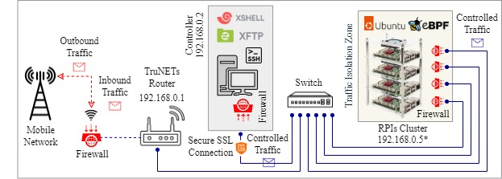

# QUT-DV25 Dataset

**A Dataset for Dynamic Analysis of Next-Gen Software Supply Chain Attacks**

[](https://doi.org/10.7910/DVN/LBMXJY)

[Selected Package List](https://qut-dv25.dysec.io)

## Overview

QUT-DV25 is a comprehensive dataset designed to support research into the detection of malicious activity in the Python Package Index (PyPI) ecosystem. It provides multi-layered behavioral traces from dynamic analysis of Python package installations and executions, captured via eBPF-based observability tools on Raspberry Pi systems running Ubuntu 24.4 LTS.

<p align="center">
  
</p>
<p align="center"><em>Figure 1: The isolated testbed configuration visualization for QUT-DV25</em></p>

## Description

The dataset includes six types of behavioral traces collected during package installation and execution:

- **Filetop Traces**: Monitor file read/write operations; useful for detecting missing or suspicious files like `setup.py`.
- **Installation Traces**: Log package dependency chains and anomalies, including unexpected dependencies and suspicious post-install scripts.
- **Opensnoop Traces**: Track access to sensitive files and directories (e.g., `/root/.ssh`).
- **Pattern Traces**: Capture behavioral sequences such as repeated socket creation or process spawning.
- **System Call Traces**: Record low-level system interactions such as unauthorized file or process operations.
- **TCP Traces**: Track outbound network connections and port usage to detect remote access or anomalous traffic.

These traces enable in-depth behavioral analysis for identifying indicators of compromise and software supply chain threats.

## Data Source

The dataset was built from dynamic analysis traces of Python packages executed in sandboxed environments using eBPF-based monitoring during install-time and post-install-time. Malicious samples were sourced from confirmed threat reports and verified incidents. Benign packages were carefully selected from trusted PyPI projects as counterparts to the malicious samples for balanced comparison.

## Dataset Details

- **Publication Date**: May 8, 2025  
- **Data Collection Period**: June 1, 2024 - December 28, 2024  
- **Time Coverage**: June 1, 2024 - May 7, 2025  
- **Languages**: English  
- **Data Type**: Raw trace files and processed CSV data  
- **Software Used**:
  - eBPF v0.20.0
  - Ubuntu 24.4 LTS
  - Python 3.8-3.12
  - bpftool v7.4.0
  - bpftrace v0.20.2
  - linux-headers 6.8.0-1012-raspi
  - Raspberry Pi 4.0

## Keywords

`Dynamic Analysis` `Malicious Detection` `Software Supply Chain` `PyPI` `Security` `eBPF` `Behavioral Traces`

## Dataset Statistics

| Statistic                     | Value        |
|------------------------------|--------------|
| Number of variables          | 38           |
| Number of observations       | 14,271       |
| Missing cells                | 0            |
| Missing cells (%)            | 0.0%         |
| Duplicate rows               | 0            |
| Duplicate rows (%)           | 0.0%         |
| Total raw data size in memory| 2.2 TB       |
| Total processed data size    | 3.6 GB       |

### Variable Types

| Type        | Count |
|-------------|-------|
| Text        | 18    |
| Categorical | 9     |
| Numeric     | 11    |

## eBPF-Based Feature Sets

The following feature sets are extracted using **eBPF tracing** during package execution. Each set corresponds to a specific behavioral trace type for a package.

| **Feature Set** | **Description** |
|-----------------|-----------------|
| `Filetop Traces` | **File I/O processes** - Captures file access patterns; useful to detect abnormal access or missing critical files. |
| `Install Traces` | **Installation traces** - Logs installation-time events; detects indirect or hidden dependency installs used maliciously. |
| `Opensnoop Traces` | **File open attempts** - Monitors system calls to open files; flags access to sensitive or protected directories. |
| `TCP Traces` | **TCP activity** - Captures network traffic during execution; useful to detect contact with suspicious or blacklisted IPs. |
| `SysCall Traces` | **System call traces** - Logs low-level system interactions; can indicate privilege escalation, sabotage, or misuse. |
| `Pattern Traces` | **Behavioral patterns** - Extracts sequence patterns in execution (e.g., I/O loops, memory access, or payload triggers). |


## Feature Definitions and Examples

### 1. General Package Information

| Feature Name   | Definition                                 | Example                |
|----------------|---------------------------------------------|------------------------|
| `Package_Name` | Unique identifier of the package and version | `1337z-4.4.7`, `1337x-1.2.6` |

---

### 2. Filetop Traces (Process & Data Transfer Behavior)

| Feature Name           | Definition                                                             | Example                                      |
|------------------------|------------------------------------------------------------------------|----------------------------------------------|
| `Read_Processes`       | Processes that perform read operations during installation             | `pip reads setup.py for metadata`           |
| `Write_Processes`      | Processes that write data to disk during installation                  | `writes to site-packages and cached .whl`   |
| `Read_Data_Transfer`   | Instances of network-based data download                               | `pip reads .whl file from PyPI via HTTPS`   |
| `Write_Data_Transfer`  | Instances of writing downloaded data to the system                     | `pip writes downloaded .whl into the local` |
| `File_Access_Processes`| Processes accessing files (e.g., scripts, modules)                     | `Accesses __init__.py during installation`  |

---

### 3. Install Traces (Dependency Information)

| Feature Name            | Definition                                      | Example                                    |
|-------------------------|-------------------------------------------------|--------------------------------------------|
| `Total_Dependencies`    | Total count of both direct and indirect dependencies | `2 (attrs-24.2.0; beautifulsoup4-0.1)`     |
| `Direct_Dependencies`   | Dependencies explicitly declared in `setup.py`       | `1 (beautifulsoup4-0.1)`                   |
| `Indirect_Dependencies` | Dependencies brought by other libraries             | `1 (attrs-24.2.0)`                         |

---

### 4. Opensnoop Traces (Directory Access Patterns)

| Feature Name         | Definition                                             | Example                                               |
|----------------------|--------------------------------------------------------|--------------------------------------------------------|
| `Root_DIR_Access`    | Accesses to `/root` directories                        | `/root/.ssh/authorized_keys`                          |
| `Temp_DIR_Access`    | Accesses to temp directories (`/tmp`, etc.)            | `/tmp/pip-wheel-pzrcqrtt/htaces.whl`                  |
| `Home_DIR_Access`    | Accesses to user home directories                      | `/home/Analysis/Env/1337z-4.4.7.`                     |
| `User_DIR_Access`    | Accesses to system-wide Python directories             | `/usr/lib/python3.12/lib-dynload`                     |
| `Sys_DIR_Access`     | Accesses to system configuration files in `/sys`       | `/sys/kernel/net/ipv4/ip_forward`                    |
| `Etc_DIR_Access`     | Accesses to files in `/etc`                            | `/etc/host.conf`, `/etc/nftables.conf`               |
| `Other_DIR_Access`   | Accesses to other or hidden directories                | `/proc/sys/net/ipv4/conf`, `~/.ssh`                  |

---

### 5. TCP Traces (Network Behavior)

| Feature Name         | Definition                                             | Example                                |
|----------------------|--------------------------------------------------------|----------------------------------------|
| `State_Transition`   | Observed TCP connection state transitions              | `{CLOSE -> ->: 15, SYN_SENT}`          |
| `Local_IPs_Access`   | Accesses to private/local IP addresses                 | `192.168.0.51`, `192.168.0.1`          |
| `Remote_IPs_Access`  | Accesses to remote/public IPs                          | `151.101.0.223`, `3.164.36.120`        |
| `Local_Port_Access`  | Ports opened by the package locally                    | `52904`, `53158`, `34214`              |
| `Remote_Port_Access` | Remote ports connected to (e.g., web or IRC)           | `443`, `23`, `6667`                    |

---

### 6. SysCall Traces (System Call Categories)

| Feature Name          | Definition                                          | Example                                   |
|-----------------------|-----------------------------------------------------|-------------------------------------------|
| `IO_Operations`       | Input/output-related system calls                  | `ioctl`, `poll`, `readv`                  |
| `File_Operations`     | File creation or manipulation calls                | `open`, `openat`, `creat`                 |
| `Network_Operations`  | Socket/network-related operations                  | `socket`, `connect`, `accept`             |
| `Time_Operations`     | Calls to manage system or process time             | `clock_gettime`, `timer_delete`           |
| `Security_Operations` | User and group permission-related syscalls         | `getuid`, `setuid`, `setgid`              |
| `Process_Operations`  | Creation and control of processes                  | `fork`, `vfork`, `clone`                  |

---

### 7. Pattern Traces (Behavioral Patterns-System Call Sequences)

| Feature Name  | Pattern Description                         | Example Sequence                            |
|---------------|----------------------------------------------|---------------------------------------------|
| `Pattern_1`   | Reading file metadata                        | `newfstatat → openat → fstat`               |
| `Pattern_2`   | Reading contents from a file                 | `read → pread64 → lseek`                    |
| `Pattern_3`   | Writing data to a file                       | `write → pwrite64 → fsync`                  |
| `Pattern_4`   | Creating a network socket                    | `socket → bind → listen`                    |
| `Pattern_5`   | Spawning a new process                       | `fork → execve → wait4`                     |
| `Pattern_6`   | Memory allocation and protection             | `mmap → mprotect → munmap → no-fd`          |
| `Pattern_7`   | File descriptor management                   | `dup → dup2 → close → stdout`               |
| `Pattern_8`   | Inter-process communication with pipes       | `pipe → write → read → pipe-fd`             |
| `Pattern_9`   | File locking mechanism                       | `fcntl → lockf → close → file-fd`           |
| `Pattern_10`  | Error handling in file access                | `open → read → error=ENOENT → no-fd`        |

---

### 8. Labels

| Feature Name | Definition                      | Example |
|--------------|----------------------------------|---------|
| `Labels`     | Classification target label: 0 (benign), 1 (malicious) | `[1, 0]` |

---

# Croissant Validation Report

## Validation Results
--------------------------------------------------------------------------------
### JSON Format Validation
✓
The file is valid JSON.
### Croissant Schema Validation
✓
The dataset passes Croissant validation.
### Records Generation Test
✓
No record sets found to validate.
## JSON-LD REFERENCE

```json
{
  "@context": {
    "@language": "en",
    "@vocab": "https://schema.org/",
    "citeAs": "cr:citeAs",
    "column": "cr:column",
    "conformsTo": "dct:conformsTo",
    "cr": "http://mlcommons.org/croissant/",
    "rai": "http://mlcommons.org/croissant/RAI/",
    "data": {
      "@id": "cr:data",
      "@type": "@json"
    },
    "dataType": {
      "@id": "cr:dataType",
      "@type": "@vocab"
    },
    "dct": "http://purl.org/dc/terms/",
    "examples": {
      "@id": "cr:examples",
      "@type": "@json"
    },
    "extract": "cr:extract",
    "field": "cr:field",
    "fileProperty": "cr:fileProperty",
    "fileObject": "cr:fileObject",
    "fileSet": "cr:fileSet",
    "format": "cr:format",
    "includes": "cr:includes",
    "isLiveDataset": "cr:isLiveDataset",
    "jsonPath": "cr:jsonPath",
    "key": "cr:key",
    "md5": "cr:md5",
    "parentField": "cr:parentField",
    "path": "cr:path",
    "recordSet": "cr:recordSet",
    "references": "cr:references",
    "regex": "cr:regex",
    "repeated": "cr:repeated",
    "replace": "cr:replace",
    "sc": "https://schema.org/",
    "separator": "cr:separator",
    "source": "cr:source",
    "subField": "cr:subField",
    "transform": "cr:transform",
    "wd": "https://www.wikidata.org/wiki/",
    "@base": "cr_base_iri/"
  },
  "@type": "sc:Dataset",
  "conformsTo": "http://mlcommons.org/croissant/1.0",
  "name": "QUT-DV25",
  "url": "https://doi.org/10.7910/DVN/LBMXJY",
  "creator": [
    {
      "@type": "Person",
      "givenName": "Sk Tanzir",
      "familyName": "Mehedi",
      "affiliation": {
        "@type": "Organization",
        "name": "Queensland University of Technology"
      },
      "sameAs": "https://orcid.org/0000-0003-4435-7856",
      "@id": "https://orcid.org/0000-0003-4435-7856",
      "identifier": "https://orcid.org/0000-0003-4435-7856",
      "name": "Mehedi, Sk Tanzir"
    },
    {
      "@type": "Person",
      "givenName": "Raja",
      "familyName": "Jurdak",
      "affiliation": {
        "@type": "Organization",
        "name": "Queensland University of Technology"
      },
      "sameAs": "https://orcid.org/0000-0001-7517-0782",
      "@id": "https://orcid.org/0000-0001-7517-0782",
      "identifier": "https://orcid.org/0000-0001-7517-0782",
      "name": "Jurdak, Raja"
    },
    {
      "@type": "Person",
      "givenName": "Chadni",
      "familyName": "Islam",
      "affiliation": {
        "@type": "Organization",
        "name": "Edith Cowan University"
      },
      "sameAs": "https://orcid.org/0000-0002-6349-6483",
      "@id": "https://orcid.org/0000-0002-6349-6483",
      "identifier": "https://orcid.org/0000-0002-6349-6483",
      "name": "Islam, Chadni"
    },
    {
      "@type": "Person",
      "givenName": "Gowri",
      "familyName": "Ramachandran",
      "affiliation": {
        "@type": "Organization",
        "name": "Queensland University of Technology"
      },
      "sameAs": "https://orcid.org/0000-0001-5944-1335",
      "@id": "https://orcid.org/0000-0001-5944-1335",
      "identifier": "https://orcid.org/0000-0001-5944-1335",
      "name": "Ramachandran, Gowri"
    }
  ],
  "description": "A Dataset for Dynamic Analysis of Next-Gen Software Supply Chain Attacks This dataset captures multi-layered behavioral traces associated with Python package installation and execution, aimed at supporting research in malware detection and software supply chain security. It consists of six trace categories: Filetop traces monitor file read/write operations, highlighting missing or suspicious files (e.g., setup.py) and unauthorized modifications indicative of data exfiltration. Installation traces record dependency chains and detect anomalies like unexpected dependencies, resolution errors, or suspicious post-install scripts often linked to dependency confusion attacks. Opensnoop traces log file access to sensitive directories (e.g., /root/.ssh), revealing unauthorized access attempts or code injection. Pattern traces analyze sequential behaviors (e.g., repeated socket and process creation) to detect loops, version cycling, and stealthy activity patterns. System call traces capture low-level OS operations, identifying unauthorized process, file, or network interactions correlated with system-level sabotage. TCP traces record outbound network connections and state transitions, enabling detection of unusual ports (e.g., 6667), remote access attempts, and anomalous traffic patterns. Together, these datasets offer a rich foundation for identifying behavioral indicators of compromise in Python packages.",
  "keywords": [
    "Computer and Information Science",
    "Software Supply Chain Security",
    "Dynamic Analysis",
    "Malicious Detection",
    "Software Supply Chain",
    "PyPI ecosystem"
  ],
  "license": "http://creativecommons.org/publicdomain/zero/1.0",
  "datePublished": "2025-05-08",
  "dateModified": "2025-05-20",
  "includedInDataCatalog": {
    "@type": "DataCatalog",
    "name": "Harvard Dataverse",
    "url": "https://dataverse.harvard.edu"
  },
  "publisher": {
    "@type": "Organization",
    "name": "Harvard Dataverse"
  },
  "version": "4.0",
  "citeAs": "@data{DVN/LBMXJY_2025,author = {Mehedi, Sk Tanzir and Jurdak, Raja and Islam, Chadni and Ramachandran, Gowri},publisher = {Harvard Dataverse},title = {QUT-DV25},year = {2025},url = {https://doi.org/10.7910/DVN/LBMXJY}}",
  "citation": [
    {
      "@type": "CreativeWork",
      "name": "Mehedi, Sk Tanzir, Raja Jurdak, Chadni Islam, and Gowri Ramachandran. 2025. \"QUT-DV25: A Dataset for Dynamic Analysis of Next-Gen Software Supply Chain Attacks.\" arXiv.",
      "@id": "https://arxiv.org/abs/2505.13804",
      "identifier": "https://arxiv.org/abs/2505.13804",
      "url": "https://arxiv.org/abs/2505.13804"
    }
  ],
  "temporalCoverage": [
    "2024-06-01/2025-05-07"
  ],
  "distribution": [
    {
      "@type": "cr:FileObject",
      "@id": "QUT-DV25_datasets/QUT-DV25_Datasets.zip",
      "name": "QUT-DV25_Datasets.zip",
      "encodingFormat": "application/zip",
      "md5": "09553107f6263a17a2db513f6bfabb44",
      "contentSize": "2142243738",
      "description": "The QUT-DV25 processed datasets include Filetop traces, Installation traces, Opensnoop traces, Pattern traces, System call traces, and TCP traces. In addition, the dataset provides raw data samples for both malicious and benign packages, covering all trace types.",
      "contentUrl": "https://dataverse.harvard.edu/api/access/datafile/11542393"
    }
  ]
}
```

## Citation

If you use this dataset in your research, please cite it as:

**Mehedi, Sk Tanzir; Jurdak, Raja; Islam, Chadni; Ramachandran, Gowri. (2025). QUT-DV25 [Data set]. Harvard Dataverse. https://doi.org/10.7910/DVN/LBMXJY**

## Authors

- **Sk Tanzir Mehedi** (Queensland University of Technology)  
  [ORCID](https://orcid.org/0000-0003-4435-7856)
- **Raja Jurdak** (Queensland University of Technology)  
  [ORCID](https://orcid.org/0000-0001-7517-0782)
- **Chadni Islam** (Edith Cowan University)  
  [ORCID](https://orcid.org/0000-0002-6349-6483)
- **Gowri Ramachandran** (Queensland University of Technology)  
  [ORCID](https://orcid.org/0000-0001-5944-1335)

## License

Please refer to the [Dataverse page](https://doi.org/10.7910/DVN/LBMXJY) for licensing terms.

## Contact

For questions or collaborations, please contact:

**Sk Tanzir Mehedi**  
Email available on the Dataverse contact page: [Dataverse Link](https://doi.org/10.7910/DVN/LBMXJY)

---

