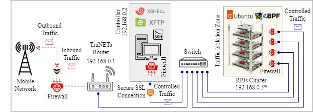

# QUT-DV25 Dataset

**A Dataset for Dynamic Analysis of Next-Gen Software Supply Chain Attacks**

[](https://doi.org/10.7910/DVN/LBMXJY)

[Selected Package List](https://qut-dv25.dysec.io)

## Overview

QUT-DV25 is a comprehensive dataset designed to support research into the detection of malicious activity in the Python Package Index (PyPI) ecosystem. It provides multi-layered behavioral traces from dynamic analysis of Python package installations and executions, captured via eBPF-based observability tools on Raspberry Pi systems running Ubuntu 24.4 LTS.

<p align="center">
  
</p>
<p align="center"><em>Figure 1: The isolated testbed configuration visualization for QUT-DV25</em></p>

## Description

The dataset includes six types of behavioral traces collected during package installation and execution:

- **Filetop Traces**: Monitor file read/write operations; useful for detecting missing or suspicious files like `setup.py`.
- **Installation Traces**: Log package dependency chains and anomalies, including unexpected dependencies and suspicious post-install scripts.
- **Opensnoop Traces**: Track access to sensitive files and directories (e.g., `/root/.ssh`).
- **Pattern Traces**: Capture behavioral sequences such as repeated socket creation or process spawning.
- **System Call Traces**: Record low-level system interactions such as unauthorized file or process operations.
- **TCP Traces**: Track outbound network connections and port usage to detect remote access or anomalous traffic.

These traces enable in-depth behavioral analysis for identifying indicators of compromise and software supply chain threats.

## Data Source

The dataset was built from dynamic analysis traces of Python packages executed in sandboxed environments using eBPF-based monitoring during install-time and post-install-time. Malicious samples were sourced from confirmed threat reports and verified incidents. Benign packages were carefully selected from trusted PyPI projects as counterparts to the malicious samples for balanced comparison.

## Dataset Details

- **Publication Date**: May 8, 2025  
- **Data Collection Period**: June 1, 2024 - December 28, 2024  
- **Time Coverage**: June 1, 2024 - May 7, 2025  
- **Languages**: English  
- **Data Type**: Raw trace files and processed CSV data  
- **Software Used**:
  - eBPF v0.20.0
  - Ubuntu 24.4 LTS
  - Python 3.8-3.12
  - bpftool v7.4.0
  - bpftrace v0.20.2
  - linux-headers 6.8.0-1012-raspi
  - Raspberry Pi 4.0

## Keywords

`Dynamic Analysis` `Malicious Detection` `Software Supply Chain` `PyPI` `Security` `eBPF` `Behavioral Traces`

## Dataset Statistics

| Statistic                     | Value        |
|------------------------------|--------------|
| Number of variables          | 36           |
| Number of observations       | 14,271       |
| Missing cells                | 0            |
| Missing cells (%)            | 0.0%         |
| Duplicate rows               | 0            |
| Duplicate rows (%)           | 0.0%         |
| Total raw data size in memory| 2.2 TB       |
| Total processed data size    | 3.6 GB       |

### Variable Types

| Type        | Count |
|-------------|-------|
| Categorical | 14    |
| Numerical   | 11    |
| Pattern     | 11    |

## Descriptive Statistics of the Raw Dataset Across Numerical Trace Types

The following table summarises the descriptive statistics extracted from benign (B) and malicious (M) traces across different pattern categories.

| **Traces** | **Features** | **Mean (B)** | **SD (B)** | **Min (B)** | **Max (B)** | **Mean (M)** | **SD (M)** | **Min (M)** | **Max (M)** |
|------------|--------------|--------------|------------|-------------|-------------|--------------|------------|-------------|-------------|
| Filetop | Read_Processes | 18.06 | 19.31 | 0 | 223 | 10.35 | 10.89 | 0 | 207 |
|  | Write_Processes | 1683.29 | 1443.39 | 0 | 10250 | 1680.23 | 1342.18 | 0 | 9152 |
|  | Read_Data_Transfer | 15.63 | 23.06 | 0 | 432 | 4.55 | 7.46 | 0 | 86 |
|  | Write_Data_Transfer | 14.87 | 21.92 | 0 | 418 | 5.12 | 8.03 | 0 | 90 |
| Install | Total_Dependency | 6.02 | 11.48 | 0 | 685 | 0.91 | 2.74 | 0 | 56 |
|  | Direct_Dependency | 1.84 | 4.13 | 0 | 116 | 0.03 | 0.07 | 0 | 4 |
|  | Indirect_Dependency | 4.15 | 12.60 | 0 | 569 | 0.75 | 3.23 | 0 | 52 |
| Opensnoop | Root_DIR_Access | 51.54 | 72.73 | 10 | 582 | 87.17 | 139.07 | 16 | 951 |
|  | Temp_DIR_Access | 148.33 | 341.18 | 0 | 3305 | 65.28 | 133.19 | 0 | 1066 |
|  | Home_DIR_Access | 1659.03 | 1505.30 | 0 | 11085 | 811.40 | 722.73 | 0 | 5279 |
|  | User_DIR_Access | 1796.54 | 3100.67 | 176 | 64391 | 3212.86 | 4161.69 | 82 | 46354 |
|  | Sys_DIR_Access | 646.35 | 545.65 | 6 | 9731 | 290.48 | 190.13 | 5 | 762 |
|  | Etc_DIR_Access | 757.75 | 1422.77 | 41 | 22061 | 779.00 | 1619.00 | 14 | 19966 |
|  | Other_DIR_Access | 3012.21 | 3329.42 | 17 | 21481 | 1570.21 | 1769.97 | 83 | 12240 |
| TCP | Local_IPs_Access | 2.19 | 1.31 | 2 | 5 | 2.39 | 0.84 | 1 | 6 |
|  | Remote_IPs_Access | 91.30 | 116.70 | 0 | 652 | 38.19 | 28.76 | 0 | 98 |
|  | Local_Port_Access | 210.73 | 148.43 | 0 | 998 | 97.56 | 81.20 | 0 | 743 |
|  | Remote_Port_Access | 22.44 | 26.27 | 0 | 91 | 11.39 | 9.17 | 0 | 56 |
| Syscall | IO_Operations | 5249.67 | 28662.64 | 0 | 1147052 | 794.65 | 3302.19 | 0 | 123576 |
|  | File_Operations | 13.11 | 1.93 | 0 | 17 | 10.49 | 3.53 | 0 | 16 |
|  | Network_Operations | 107.30 | 48.86 | 0 | 245 | 48.92 | 50.38 | 0 | 588 |
|  | Time_Operations | 6.27 | 6.56 | 0 | 210 | 2.50 | 4.45 | 0 | 66 |
|  | Security_Operations | 0.36 | 0.48 | 0 | 2 | 3.70 | 4.90 | 0 | 21 |
|  | Process_Operations | 91.27 | 119.80 | 0 | 4687 | 37.73 | 196.23 | 0 | 16307 |

## Descriptive Statistics of the Raw Dataset (Across Pattern Trace Types)

The following table summarises the descriptive statistics extracted from benign (B) and malicious (M) traces across different pattern categories.

| **Trace Type** | **Feature** | **Patterns (B)** | **Patterns (M)** | **N-grams (B)** | **N-grams (M)** | **Avg N-grams (B)** | **Avg N-grams (M)** |
|----------------|-------------|------------------|------------------|------------------|------------------|----------------------|----------------------|
| TCP | State_TRX | 102 | 63 | 7,144 | 7,127 | 1.0 | 1.0 |
| Pattern | Pattern_1 | 3 | 4 | 7,144 | 6,768 | 1.000 | 0.950 |
|  | Pattern_2 | 2 | 4 | 7,125 | 6,618 | 0.997 | 0.929 |
|  | Pattern_3 | 3 | 1 | 7,122 | 6,609 | 0.997 | 0.927 |
|  | Pattern_4 | 4 | 6 | 7,122 | 6,609 | 0.997 | 0.927 |
|  | Pattern_5 | 2 | 2 | 7,122 | 6,607 | 0.997 | 0.927 |
|  | Pattern_6 | 1 | 3 | 7,122 | 6,618 | 0.997 | 0.929 |
|  | Pattern_7 | 1 | 2 | 7,122 | 6,618 | 0.997 | 0.929 |
|  | Pattern_8 | 2 | 1 | 7,122 | 6,607 | 0.997 | 0.927 |
|  | Pattern_9 | 2 | 3 | 7,122 | 6,607 | 0.997 | 0.927 |
|  | Pattern_10 | 2 | 9 | 7,122 | 6,607 | 0.997 | 0.927 |


## eBPF-Based Feature Sets

The following feature sets are extracted using **eBPF tracing** during package execution. Each set corresponds to a specific behavioral trace type for a package.

| **Feature Set** | **Description** |
|-----------------|-----------------|
| `Filetop Traces` | **File I/O processes** - Captures file access patterns; useful to detect abnormal access or missing critical files. |
| `Install Traces` | **Installation traces** - Logs installation-time events; detects indirect or hidden dependency installs used maliciously. |
| `Opensnoop Traces` | **File open attempts** - Monitors system calls to open files; flags access to sensitive or protected directories. |
| `TCP Traces` | **TCP activity** - Captures network traffic during execution; useful to detect contact with suspicious or blacklisted IPs. |
| `SysCall Traces` | **System call traces** - Logs low-level system interactions; can indicate privilege escalation, sabotage, or misuse. |
| `Pattern Traces` | **Behavioral patterns** - Extracts sequence patterns in execution (e.g., I/O loops, memory access, or payload triggers). |


## Feature Definitions and Examples

### 1. General Package Information

| Feature Name   | Definition                                 | Example                |
|----------------|---------------------------------------------|------------------------|
| `Package_Name` | Unique identifier of the package and version | `1337z-4.4.7`, `1337x-1.2.6` |

---

### 2. Filetop Traces (Process & Data Transfer Behavior)

| Feature Name           | Definition                                                             | Example                                      |
|------------------------|------------------------------------------------------------------------|----------------------------------------------|
| `Read_Processes`       | Processes that perform read operations during installation             | `pip reads setup.py for metadata`           |
| `Write_Processes`      | Processes that write data to disk during installation                  | `writes to site-packages and cached .whl`   |
| `Read_Data_Transfer`   | Instances of network-based data download                               | `pip reads .whl file from PyPI via HTTPS`   |
| `Write_Data_Transfer`  | Instances of writing downloaded data to the system                     | `pip writes downloaded .whl into the local` |
| `File_Access_Processes`| Processes accessing files (e.g., scripts, modules)                     | `Accesses __init__.py during installation`  |

---

### 3. Install Traces (Dependency Information)

| Feature Name            | Definition                                      | Example                                    |
|-------------------------|-------------------------------------------------|--------------------------------------------|
| `Total_Dependencies`    | Total count of both direct and indirect dependencies | `2 (attrs-24.2.0; beautifulsoup4-0.1)`     |
| `Direct_Dependencies`   | Dependencies explicitly declared in `setup.py`       | `1 (beautifulsoup4-0.1)`                   |
| `Indirect_Dependencies` | Dependencies brought by other libraries             | `1 (attrs-24.2.0)`                         |

---

### 4. Opensnoop Traces (Directory Access Patterns)

| Feature Name         | Definition                                             | Example                                               |
|----------------------|--------------------------------------------------------|--------------------------------------------------------|
| `Root_DIR_Access`    | Accesses to `/root` directories                        | `/root/.ssh/authorized_keys`                          |
| `Temp_DIR_Access`    | Accesses to temp directories (`/tmp`, etc.)            | `/tmp/pip-wheel-pzrcqrtt/htaces.whl`                  |
| `Home_DIR_Access`    | Accesses to user home directories                      | `/home/Analysis/Env/1337z-4.4.7.`                     |
| `User_DIR_Access`    | Accesses to system-wide Python directories             | `/usr/lib/python3.12/lib-dynload`                     |
| `Sys_DIR_Access`     | Accesses to system configuration files in `/sys`       | `/sys/kernel/net/ipv4/ip_forward`                    |
| `Etc_DIR_Access`     | Accesses to files in `/etc`                            | `/etc/host.conf`, `/etc/nftables.conf`               |
| `Other_DIR_Access`   | Accesses to other or hidden directories                | `/proc/sys/net/ipv4/conf`, `~/.ssh`                  |

---

### 5. TCP Traces (Network Behavior)

| Feature Name         | Definition                                             | Example                                |
|----------------------|--------------------------------------------------------|----------------------------------------|
| `State_Transition`   | Observed TCP connection state transitions              | `{CLOSE -> ->: 15, SYN_SENT}`          |
| `Local_IPs_Access`   | Accesses to private/local IP addresses                 | `192.168.0.51`, `192.168.0.1`          |
| `Remote_IPs_Access`  | Accesses to remote/public IPs                          | `151.101.0.223`, `3.164.36.120`        |
| `Local_Port_Access`  | Ports opened by the package locally                    | `52904`, `53158`, `34214`              |
| `Remote_Port_Access` | Remote ports connected to (e.g., web or IRC)           | `443`, `23`, `6667`                    |

---

### 6. SysCall Traces (System Call Categories)

| Feature Name          | Definition                                          | Example                                   |
|-----------------------|-----------------------------------------------------|-------------------------------------------|
| `IO_Operations`       | Input/output-related system calls                  | `ioctl`, `poll`, `readv`                  |
| `File_Operations`     | File creation or manipulation calls                | `open`, `openat`, `creat`                 |
| `Network_Operations`  | Socket/network-related operations                  | `socket`, `connect`, `accept`             |
| `Time_Operations`     | Calls to manage system or process time             | `clock_gettime`, `timer_delete`           |
| `Security_Operations` | User and group permission-related syscalls         | `getuid`, `setuid`, `setgid`              |
| `Process_Operations`  | Creation and control of processes                  | `fork`, `vfork`, `clone`                  |

---

### 7. Pattern Traces (Behavioral Patterns-System Call Sequences)

| Feature Name  | Pattern Description                         | Example Sequence                            |
|---------------|----------------------------------------------|---------------------------------------------|
| `Pattern_1`   | Reading file metadata                        | `newfstatat → openat → fstat`               |
| `Pattern_2`   | Reading contents from a file                 | `read → pread64 → lseek`                    |
| `Pattern_3`   | Writing data to a file                       | `write → pwrite64 → fsync`                  |
| `Pattern_4`   | Creating a network socket                    | `socket → bind → listen`                    |
| `Pattern_5`   | Spawning a new process                       | `fork → execve → wait4`                     |
| `Pattern_6`   | Memory allocation and protection             | `mmap → mprotect → munmap → no-fd`          |
| `Pattern_7`   | File descriptor management                   | `dup → dup2 → close → stdout`               |
| `Pattern_8`   | Inter-process communication with pipes       | `pipe → write → read → pipe-fd`             |
| `Pattern_9`   | File locking mechanism                       | `fcntl → lockf → close → file-fd`           |
| `Pattern_10`  | Error handling in file access                | `open → read → error=ENOENT → no-fd`        |

---

### 8. Labels

| Feature Name | Definition                      | Example |
|--------------|----------------------------------|---------|
| `Labels`     | Classification target label: 0 (benign), 1 (malicious) | `[1, 0]` |

---

# Environment Setup Instructions

## Testbed and Infrastructure

### Router Configuration

| Parameter     | Value               |
|--------------|---------------------|
| Address      | 192.168.0.1         |
| SSID (5G)    | *(Your 5G SSID)*    |
| SSID (2.4G)  | *(Your 2.4G SSID)*  |
| Password     | *(Router password)* |

### Raspberry Pi Clusters

**Operating System**: Ubuntu 24.04 LTS (64-bit)

#### Cluster 1 (TruNETS-QUT-1 to 8)

| Hostname           | IP Address      | Memory |
|--------------------|-----------------|--------|
| TruNETS-QUT-1.local | 192.168.0.50   | 4GB    |
| TruNETS-QUT-2.local | 192.168.0.51   | 4GB    |
| TruNETS-QUT-3.local | 192.168.0.52   | 4GB    |
| TruNETS-QUT-4.local | 192.168.0.53   | 4GB    |
| TruNETS-QUT-5.local | 192.168.0.54   | 4GB    |
| TruNETS-QUT-6.local | 192.168.0.55   | 4GB    |
| TruNETS-QUT-7.local | 192.168.0.56   | 4GB    |
| TruNETS-QUT-8.local | 192.168.0.57   | 4GB    |

#### Cluster 2 (TruNETS-QUT-9 to 16)

| Hostname            | IP Address      | Memory |
|---------------------|-----------------|--------|
| TruNETS-QUT-9.local  | 192.168.0.58   | 4GB    |
| TruNETS-QUT-10.local | 192.168.0.59   | 4GB    |
| TruNETS-QUT-11.local | 192.168.0.60   | 4GB    |
| TruNETS-QUT-12.local | 192.168.0.61   | 4GB    |
| TruNETS-QUT-13.local | 192.168.0.62   | 16GB   |
| TruNETS-QUT-14.local | 192.168.0.63   | 4GB    |
| TruNETS-QUT-15.local | 192.168.0.64   | 4GB    |
| TruNETS-QUT-16.local | 192.168.0.65   | 4GB    |

---

### Connecting to a Node

1. **Connect to the router Wi-Fi**  
2. **Access a Pi node via SSH:**

```
ssh <username>@TruNETS-QUT-14.local
```
### SSH Setup

To check and enable SSH service:

```
sudo systemctl status ssh
sudo apt update
sudo apt install openssh-server
sudo systemctl start ssh
sudo systemctl enable ssh
```

---

### UFW Firewall Configuration

To allow SSH through the firewall and enable UFW:

```
sudo ufw status
sudo ufw allow ssh
sudo ufw enable
```

---

### Hostname and DNS Setup

To configure a custom hostname and enable local DNS resolution:

```
sudo nano /etc/hostname
sudo nano /etc/hosts
sudo systemctl restart systemd-logind.service
```

To enable `.local` resolution with Avahi:

```
sudo apt update
sudo apt install avahi-daemon
sudo systemctl start avahi-daemon
sudo systemctl enable avahi-daemon
```

---

## Optional: Remote Desktop (XRDP)

Install a desktop environment and XRDP service:

```
sudo apt update
sudo apt install ubuntu-desktop
sudo apt install xrdp xorg
sudo adduser xrdp ssl-cert
sudo ufw allow 3389/tcp
```

Check XRDP status:

```
xrdp --version
sudo systemctl status xrdp
```

---

## eBPF Monitoring Environment Setup

### Install Dependencies

Install eBPF tools and headers:

```
sudo apt install bpfcc-tools linux-headers-$(uname -r)
sudo apt install linux-tools-$(uname -r)
sudo apt install bpftrace
```

### Check Installed Tools

```
bpftool --version
sudo bpftool feature
bpftrace --version
```

---

## Dynamic Package Monitoring Workflow

### Step 1: Create Virtual Environment

```
pip install virtualenv --break-system-packages
virtualenv packageName_env_tr
source packageName_env_tr/bin/activate
```

---

### Step 2: Optional System Dependencies

Install additional dependencies (if required by the package):

```
sudo apt-get install libx11-dev libxtst-dev
```

---

### Step 3: Start eBPF Monitor

Run your eBPF monitoring script:

```bash
sudo ./monitor.sh
```

---

### Step 4: Install Target Package

Install the package you wish to monitor:

```
pip install <package-name>
```

---

### Step 5: Deactivate Environment

Exit the virtual environment after analysis:

```
deactivate
```

# Run Instructions

### 1. Prerequisites

#### 1.1 System Requirements
- **OS:** Linux (Ubuntu 20.04+) or Windows with WSL2
- **Disk:** 50 GB free space
- **RAM:** 8 GB minimum
- **GPU:** CUDA-enabled (for DL)

#### 1.2 Software Dependencies
```bash
sudo apt update
sudo apt install -y python3 python3-pip git gcc make
```

#### 1.3 Python Libraries
```bash
pip install -r requirements.txt
```

**requirements.txt**:
```
numpy
pandas
matplotlib
scikit-learn
torch
torchvision
transformers
networkx
jupyter
notebook
tqdm
requests
beautifulsoup4
```

---

## 2. Folder Structure

```
QUT-DV25/
├── Phase (i) Dataset Collection/
│   ├── QUT-DV25_Step 1 Malicious Package Info/
│   │   ├── MaliciousPackagesNameAndVersion.ipynb
│   │   ├── Analysis_MaliciousPackagesNameAndVersion.ipynb
│   ├── QUT-DV25_Step 2 Malicious Packages Info Check From Different Sources/
│   │   ├── MaliciousPackagesDetailsFromDifferentWebsites.ipynb
│   │   ├── Analysis_MaliciousPackagesDetailsFromDifferentWebsites.ipynb
│   ├── QUT-DV25_Step 3 Similarity Algorithms Implementation/
│   │   ├── FileAnalysis.ipynb
│   │   ├── runSimilarityChecking.sh
│   │   ├── SimilarityCheck.py
│   │   ├── Analysis_SimilarityAlgorithms-SearchBenignPackages.ipynb
│   ├── QUT-DV25_Step 4 Counterpart Benign Packages/
│   │   ├── CounterpartBenignPackages.ipynb
│   │   ├── DownloadSelectedBenignPackages.ipynb
│   │   ├── FinalSelectedBenignPackages.ipynb
│   │   ├── Analysis_CounterpartBenignPackages.ipynb
│
├── Phase (ii) Dataset Labeling and Validation/
│   ├── QUT-DV25_Step 1 Malicious Validation Report and Labeling/
│   │   ├── MaliciousValidatorHPC.ipynb
│   │   ├── run.sh
│   │   ├── validation.py
│   │   ├── Analysis_MaliciousValidator.ipynb
│   ├── QUT-DV25_Step 2 Benign Validation Report and Labeling/
│   │   ├── BenignValidationHPC.ipynb
│   │   ├── benign_run.sh
│   │   ├── benign_validation.py
│   │   ├── Analysis_BenignValidator.ipynb
│   ├── QUT-DV25_Step 3 Malicious Packages Metadata and Static Dataset/
│   │   ├── MaliciousPackagesDetailsFromFiles.ipynb
│   │   ├── Analysis_MaliciousPackagesDetailsFromFiles.ipynb
│
├── Phase (iii) Trace Extraction/
│   ├── QUT-DV25_Step 1 Isolated Env with RPIs/
│   │   ├── Environment Setup with eBPF Program and Linux Guidelines
│   ├── QUT-DV25_Step 2 Malicious Packages Traces/
│   │   ├── prerequisites.sh
│   │   ├── trace.sh
│   │   ├── monitor.sh
│   ├── QUT-DV25_Step 3 Benign Packages Traces/
│   │   ├── prerequisites.sh
│   │   ├── trace.sh
│   │   ├── monitor.sh
│
├── Technical Validation and Benchmarks/
│   ├── QUT-DV25_Step 1 Traces Preprocessing-Feature Engineering/
│   │   ├── Preprocessing-0.ipynb
│   │   ├── Preprocessing-1.ipynb
│   │   ├── Preprocessing-2.ipynb
│   ├── QUT-DV25_Step 2 Traditional ML Implementation/
│   │   ├── Dynamic Analysis/
│   │   │   ├── CombinedTraces/
│   │   │   │   ├── TML_CombinedTraces.ipynb
│   │   │   ├── FiletopTraces/
│   │   │   │   ├── TML FiletopTraces.ipynb
│   │   │   ├── InstallTraces/
│   │   │   │   ├── TML InstallTraces.ipynb
│   │   │   ├── OpensnoopTraces/
│   │   │   │   ├── TML OpensnoopTraces.ipynb
│   │   │   ├── PatternTraces/
│   │   │   │   ├── TML CombinedPatternTraces.ipynb
│   │   │   ├── StemtemCallTraces/
│   │   │   │   ├── TML SystemCallTraces.ipynb
│   │   │   ├── TCPTraces/
│   │   │   │   ├── TML TCPTraces.ipynb
│   │   ├── Metadata Analysis/
│   │   │   ├── MetadataAnalysis.ipynb
│   │   ├── Static Analysis/
│   │   │   ├── StaticAnalysis.ipynb
│   ├── QUT-DV25_Step 3 DL Implementation/
│   │   ├── CNN/
│   │   │   ├── CNN_Training and Validation.ipynb
│   │   │   ├── CNN_Training and Validation Graphs.ipynb
│   │   ├── Transformer Model/
│   │   │   ├── Transformer Model.ipynb
│
├── Run Procedure for Model Training and Evaluation.pdf
├── Details Overview of QUT-DV25 Datasets.pdf
├── README.md
```

---

## 3. Run Procedure by Phase

### 3.1 Phase (i) Dataset Collection

#### Step 1: Malicious Package Info
```bash
cd 'Phase (i) Dataset Collection/QUT-DV25_Step 1 Malicious Package Info'
python -m notebook MaliciousPackagesNameAndVersion.ipynb
python -m notebook Analysis_MaliciousPackagesNameAndVersion.ipynb
```

#### Step 2: Info Check From Sources
```bash
cd '../QUT-DV25_Step 2 Malicious Packages Info Check From Different Sources'
python -m notebook MaliciousPackagesDetailsFromDifferentWebsites.ipynb
python -m notebook Analysis_MaliciousPackagesDetailsFromDifferentWebsites.ipynb
```

#### Step 3: Similarity Algorithms
```bash
cd '../QUT-DV25_Step 3 Similarity Algorithms Implementation'
bash runSimilarityChecking.sh
python SimilarityCheck.py
python -m notebook FileAnalysis.ipynb
python -m notebook Analysis_SimilarityAlgorithms-SearchBenignPackages.ipynb
```

#### Step 4: Counterpart Benign Packages
```bash
cd '../QUT-DV25_Step 4 Counterpart Benign Packages'
python -m notebook CounterpartBenignPackages.ipynb
python -m notebook DownloadSelectedBenignPackages.ipynb
python -m notebook FinalSelectedBenignPackages.ipynb
python -m notebook Analysis_CounterpartBenignPackages.ipynb
```

### 3.2 Phase (ii) Dataset Labeling and Validation

#### Step 1: Malicious Validation
```bash
cd 'Phase (ii) Dataset Labeling and Validation/QUT-DV25_Step 1 Malicious Validation Report and Labeling'
bash run.sh
python validation.py
python -m notebook MaliciousValidatorHPC.ipynb
python -m notebook Analysis_MaliciousValidator.ipynb
```

#### Step 2: Benign Validation
```bash
cd '../QUT-DV25_Step 2 Benign Validation Report and Labeling'
bash benign_run.sh
python benign_validation.py
python -m notebook BenignValidatorHPC.ipynb
python -m notebook Analysis_BenignValidator.ipynb
```

#### Step 3: Static and Metadata
```bash
cd '../QUT-DV25_Step 3 Malicious Packages Metadata and Static Dataset'
python -m notebook MaliciousPackagesDetailsFromFiles.ipynb
python -m notebook Analysis_MaliciousPackagesDetailsFromFiles.ipynb
```

### 3.3 Phase (iii) Trace Extraction

> **Note:** Must be executed in a Linux-based isolated environment.

#### Step 1: Setup Environment
```bash
cd 'Phase (iii) Trace Extraction/QUT-DV25_Step 1 Isolated Env with RPIs'
```
> Follow the eBPF and kernel installation guide provided in the directory.

#### Step 2 & 3: Run Trace Scripts
```bash
cd '../QUT-DV25_Step 2 Malicious Packages Traces'
bash prerequisites.sh
bash trace.sh
bash monitor.sh

cd '../../QUT-DV25_Step 3 Benign Packages Traces'
bash prerequisites.sh
bash trace.sh
bash monitor.sh
```

---

## 4. Technical Validation and Benchmarks

### Step 1: Preprocessing and Feature Engineering
```bash
cd 'Technical Validation and Benchmarks/QUT-DV25_Step 1 Traces Preprocessing-Feature Engineering'
python -m notebook Preprocessing-0.ipynb
python -m notebook Preprocessing-1.ipynb
python -m notebook Preprocessing-2.ipynb
```

### Step 2: Traditional ML Implementation
```bash
cd '../QUT-DV25_Step 2 Traditional ML Implementation/Dynamic Analysis/CombinedTraces'
python -m notebook TML_CombinedTraces.ipynb
```
Repeat for:
- FiletopTraces/
- InstallTraces/
- OpensnoopTraces/
- PatternTraces/
- SystemCallTraces/
- TCPTraces/

Metadata & Static Analysis:
```bash
cd '../../Metadata Analysis'
python -m notebook MetadataAnalysis.ipynb
cd '../../Static Analysis'
python -m notebook StaticAnalysis.ipynb
```

### Step 3: DL Implementation

CNN Model:
```bash
cd '../../QUT-DV25_Step 3 DL Implementation/CNN'
python -m notebook CNN_Training and Validation.ipynb
python -m notebook CNN_Training and Validation Graphs.ipynb
```

Transformer Model:
```bash
cd '../Transformer Model'
python -m notebook Transformer Model.ipynb
```

# Croissant Validation Report

## Validation Results
--------------------------------------------------------------------------------
### JSON Format Validation
✓
The file is valid JSON.
### Croissant Schema Validation
✓
The dataset passes Croissant validation.
### Records Generation Test
✓
No record sets found to validate.
## JSON-LD REFERENCE

```json
{
  "@context": {
    "@language": "en",
    "@vocab": "https://schema.org/",
    "citeAs": "cr:citeAs",
    "column": "cr:column",
    "conformsTo": "dct:conformsTo",
    "cr": "http://mlcommons.org/croissant/",
    "rai": "http://mlcommons.org/croissant/RAI/",
    "data": {
      "@id": "cr:data",
      "@type": "@json"
    },
    "dataType": {
      "@id": "cr:dataType",
      "@type": "@vocab"
    },
    "dct": "http://purl.org/dc/terms/",
    "examples": {
      "@id": "cr:examples",
      "@type": "@json"
    },
    "extract": "cr:extract",
    "field": "cr:field",
    "fileProperty": "cr:fileProperty",
    "fileObject": "cr:fileObject",
    "fileSet": "cr:fileSet",
    "format": "cr:format",
    "includes": "cr:includes",
    "isLiveDataset": "cr:isLiveDataset",
    "jsonPath": "cr:jsonPath",
    "key": "cr:key",
    "md5": "cr:md5",
    "parentField": "cr:parentField",
    "path": "cr:path",
    "recordSet": "cr:recordSet",
    "references": "cr:references",
    "regex": "cr:regex",
    "repeated": "cr:repeated",
    "replace": "cr:replace",
    "sc": "https://schema.org/",
    "separator": "cr:separator",
    "source": "cr:source",
    "subField": "cr:subField",
    "transform": "cr:transform",
    "wd": "https://www.wikidata.org/wiki/",
    "@base": "cr_base_iri/"
  },
  "@type": "sc:Dataset",
  "conformsTo": "http://mlcommons.org/croissant/1.0",
  "name": "QUT-DV25",
  "url": "https://doi.org/10.7910/DVN/LBMXJY",
  "creator": [
    {
      "@type": "Person",
      "givenName": "Sk Tanzir",
      "familyName": "Mehedi",
      "affiliation": {
        "@type": "Organization",
        "name": "Queensland University of Technology"
      },
      "sameAs": "https://orcid.org/0000-0003-4435-7856",
      "@id": "https://orcid.org/0000-0003-4435-7856",
      "identifier": "https://orcid.org/0000-0003-4435-7856",
      "name": "Mehedi, Sk Tanzir"
    },
    {
      "@type": "Person",
      "givenName": "Raja",
      "familyName": "Jurdak",
      "affiliation": {
        "@type": "Organization",
        "name": "Queensland University of Technology"
      },
      "sameAs": "https://orcid.org/0000-0001-7517-0782",
      "@id": "https://orcid.org/0000-0001-7517-0782",
      "identifier": "https://orcid.org/0000-0001-7517-0782",
      "name": "Jurdak, Raja"
    },
    {
      "@type": "Person",
      "givenName": "Chadni",
      "familyName": "Islam",
      "affiliation": {
        "@type": "Organization",
        "name": "Edith Cowan University"
      },
      "sameAs": "https://orcid.org/0000-0002-6349-6483",
      "@id": "https://orcid.org/0000-0002-6349-6483",
      "identifier": "https://orcid.org/0000-0002-6349-6483",
      "name": "Islam, Chadni"
    },
    {
      "@type": "Person",
      "givenName": "Gowri",
      "familyName": "Ramachandran",
      "affiliation": {
        "@type": "Organization",
        "name": "Queensland University of Technology"
      },
      "sameAs": "https://orcid.org/0000-0001-5944-1335",
      "@id": "https://orcid.org/0000-0001-5944-1335",
      "identifier": "https://orcid.org/0000-0001-5944-1335",
      "name": "Ramachandran, Gowri"
    }
  ],
  "description": "A Dataset for Dynamic Analysis of Next-Gen Software Supply Chain Attacks This dataset captures multi-layered behavioral traces associated with Python package installation and execution, aimed at supporting research in malware detection and software supply chain security. It consists of six trace categories: Filetop traces monitor file read/write operations, highlighting missing or suspicious files (e.g., setup.py) and unauthorized modifications indicative of data exfiltration. Installation traces record dependency chains and detect anomalies like unexpected dependencies, resolution errors, or suspicious post-install scripts often linked to dependency confusion attacks. Opensnoop traces log file access to sensitive directories (e.g., /root/.ssh), revealing unauthorized access attempts or code injection. Pattern traces analyze sequential behaviors (e.g., repeated socket and process creation) to detect loops, version cycling, and stealthy activity patterns. System call traces capture low-level OS operations, identifying unauthorized process, file, or network interactions correlated with system-level sabotage. TCP traces record outbound network connections and state transitions, enabling detection of unusual ports (e.g., 6667), remote access attempts, and anomalous traffic patterns. Together, these datasets offer a rich foundation for identifying behavioral indicators of compromise in Python packages.",
  "keywords": [
    "Computer and Information Science",
    "Software Supply Chain Security",
    "Dynamic Analysis",
    "Malicious Detection",
    "Software Supply Chain",
    "PyPI ecosystem"
  ],
  "license": "http://creativecommons.org/publicdomain/zero/1.0",
  "datePublished": "2025-05-08",
  "dateModified": "2025-05-20",
  "includedInDataCatalog": {
    "@type": "DataCatalog",
    "name": "Harvard Dataverse",
    "url": "https://dataverse.harvard.edu"
  },
  "publisher": {
    "@type": "Organization",
    "name": "Harvard Dataverse"
  },
  "version": "4.0",
  "citeAs": "@data{DVN/LBMXJY_2025,author = {Mehedi, Sk Tanzir and Jurdak, Raja and Islam, Chadni and Ramachandran, Gowri},publisher = {Harvard Dataverse},title = {QUT-DV25},year = {2025},url = {https://doi.org/10.7910/DVN/LBMXJY}}",
  "citation": [
    {
      "@type": "CreativeWork",
      "name": "Mehedi, Sk Tanzir, Raja Jurdak, Chadni Islam, and Gowri Ramachandran. 2025. \"QUT-DV25: A Dataset for Dynamic Analysis of Next-Gen Software Supply Chain Attacks.\" arXiv.",
      "@id": "https://arxiv.org/abs/2505.13804",
      "identifier": "https://arxiv.org/abs/2505.13804",
      "url": "https://arxiv.org/abs/2505.13804"
    }
  ],
  "temporalCoverage": [
    "2024-06-01/2025-05-07"
  ],
  "distribution": [
    {
      "@type": "cr:FileObject",
      "@id": "QUT-DV25_datasets/QUT-DV25_Datasets.zip",
      "name": "QUT-DV25_Datasets.zip",
      "encodingFormat": "application/zip",
      "md5": "09553107f6263a17a2db513f6bfabb44",
      "contentSize": "2142243738",
      "description": "The QUT-DV25 processed datasets include Filetop traces, Installation traces, Opensnoop traces, Pattern traces, System call traces, and TCP traces. In addition, the dataset provides raw data samples for both malicious and benign packages, covering all trace types.",
      "contentUrl": "https://dataverse.harvard.edu/api/access/datafile/11542393"
    }
  ]
}
```

## Citation

If you use this dataset in your research, please cite it as:

**Mehedi, Sk Tanzir; Jurdak, Raja; Islam, Chadni; Ramachandran, Gowri. (2025). QUT-DV25 [Data set]. Harvard Dataverse. https://doi.org/10.7910/DVN/LBMXJY**

## Authors

- **Sk Tanzir Mehedi** (Queensland University of Technology)  
  [ORCID](https://orcid.org/0000-0003-4435-7856)
- **Raja Jurdak** (Queensland University of Technology)  
  [ORCID](https://orcid.org/0000-0001-7517-0782)
- **Chadni Islam** (Edith Cowan University)  
  [ORCID](https://orcid.org/0000-0002-6349-6483)
- **Gowri Ramachandran** (Queensland University of Technology)  
  [ORCID](https://orcid.org/0000-0001-5944-1335)

## License

Please refer to the [Dataverse page](https://doi.org/10.7910/DVN/LBMXJY) for licensing terms.

## Contact

For questions or collaborations, please contact:

**Sk Tanzir Mehedi**  
Email available on the Dataverse contact page: [Dataverse Link](https://doi.org/10.7910/DVN/LBMXJY)

---

